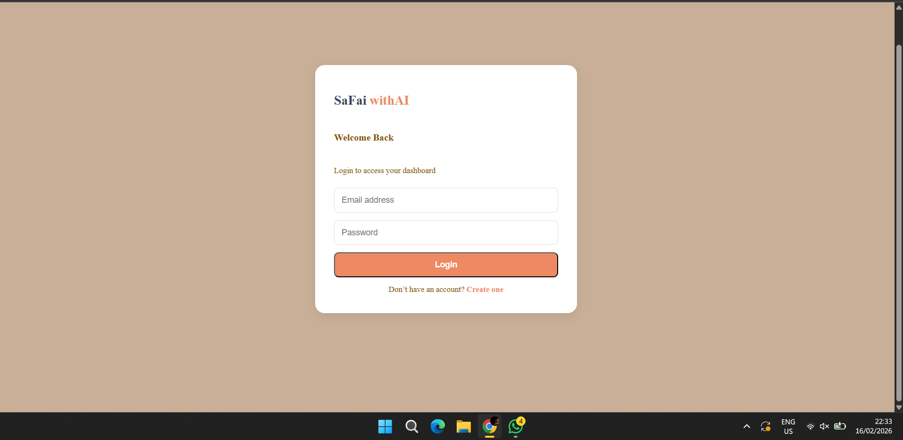
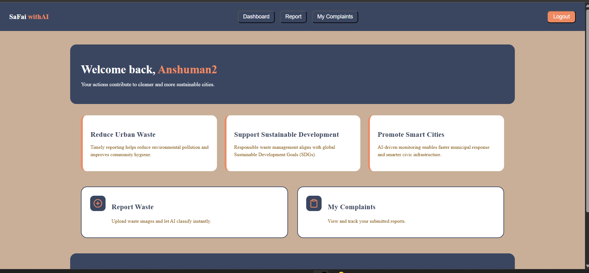
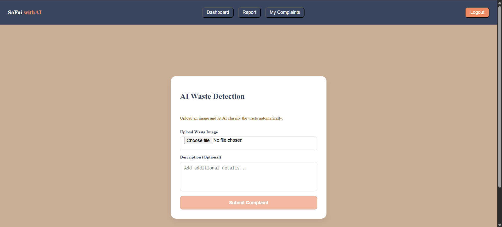
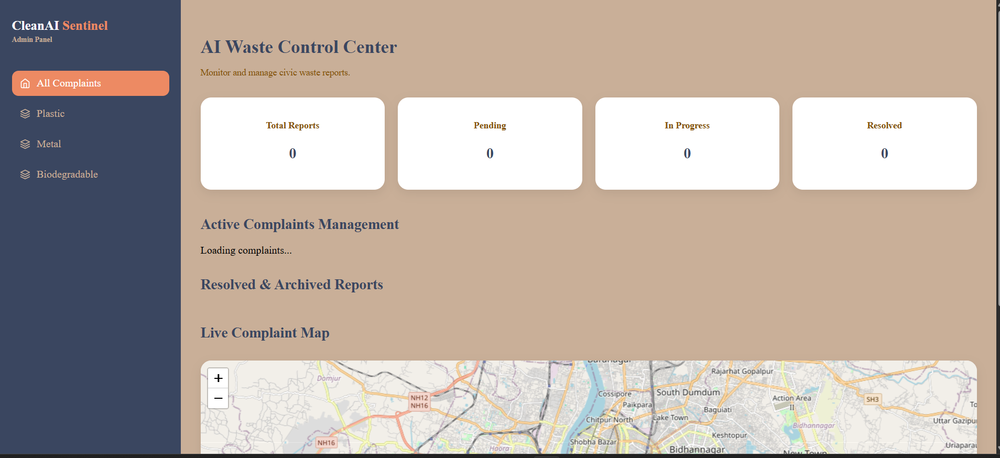

# ♻️ AI Waste Reporting System

A full-stack MERN civic-tech platform that uses AI-powered image classification to streamline urban waste reporting and management.

🌍 **Live Demo:**  
https://ai-waste-reporting.vercel.app/ 

---

## 🚀 Overview

AI Waste Reporting System enables citizens to report waste issues using image uploads and allows administrators to manage complaints efficiently through a structured dashboard.

This project demonstrates production-level full-stack architecture using:

- MERN Stack
- JWT Authentication
- Cloudinary Image Storage
- Role-Based Access Control
- REST API Design

---

## 🖼 Application Screenshots

### 🌟 Landing Page


---

### 🔐 Login Page


---

### 👤 User Dashboard


---

### 📸 Report Waste Page


---

### 🛠 Admin Control Panel


---

## 🏗 Tech Stack

### Frontend
- React (Vite)
- Axios
- React Router
- Leaflet (Maps)
- Chart.js (Analytics)
- Custom CSS UI

### Backend
- Node.js
- Express.js
- MongoDB (Mongoose)
- JWT Authentication
- Cloudinary
- Multer

---

## 🔐 Core Features

### 👤 User
- Register & Login
- AI-based waste detection
- Upload waste images
- Track complaint status
- Delete own complaint

### 🛠 Admin
- View all complaints
- Filter by category
- Update complaint status
- Archive resolved cases
- View live complaint map
- View statistics dashboard

---

## 📂 Project Structure

AI-Waste-Reporting/
│
├── assets/
│ └── screenshots/
│
├── client/
│ ├── pages/
│ ├── components/
│ └── ...
│
├── server/
│ ├── controllers/
│ ├── middleware/
│ ├── routes/
│ ├── models/
│ └── ...
│
└── README.md


---

## ⚙️ Installation Guide

### Clone Repository

```bash
git clone https://github.com/YOUR_USERNAME/ai-waste-reporting.git
cd ai-waste-reporting
Backend Setup
cd server
npm install
Create .env file:

PORT=5000
MONGO_URI=your_mongodb_uri
JWT_SECRET=your_secret
CLOUDINARY_CLOUD_NAME=your_name
CLOUDINARY_API_KEY=your_key
CLOUDINARY_API_SECRET=your_secret
Run backend:

npm run dev
Frontend Setup
cd client
npm install
Create .env:

VITE_API_URL=http://localhost:5000
Run frontend:

npm run dev
🔒 Security Features
JWT Authentication

Protected Routes

Admin Role Middleware

Ownership Validation for Delete

Secure Cloud Image Storage

🌍 Deployment
Frontend & Backend deployed using:

Render (Backend)

Render (Frontend)

🎯 Future Improvements
Real-time updates (WebSockets)

Push notifications

Advanced analytics

Pagination

AI model enhancement

Mobile version

👨‍💻 Author
Anshuman Singh
B.Tech CSE | MERN Stack Developer

⭐ Support
If you like this project:

⭐ Star the repository
🍴 Fork it
🚀 Build on top of it

